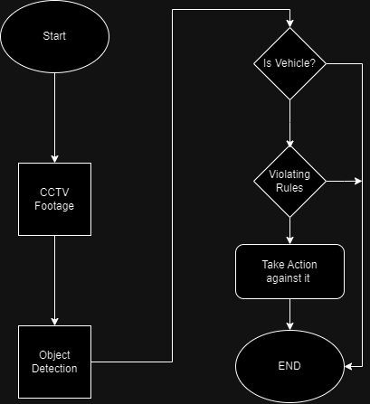

# Traffic-Regulation-System-using-AI-CV
Traffic Regulation System uses technologies such as OpenCV, PyTorch, Convolutional Neural Networks (CNNs), Transfer Learning, Object Detection, and Multi-Modality analysis. 

## Abstract
With increasing traffic volume, traffic violations are becoming more serious, posing risks to property and safety. Existing systems struggle to analyze high-volume traffic data and detect violations in real-time. We presents a real-time traffic regulation system that identifies various violations on roads and in parking lots. It employs parallel computing techniques for real-time analysis and includes optimization measures for improved performance. Experiments with real and synthetic data confirm the system's ability to promptly detect violations in high-volume traffic streams, demonstrating strong scalability with multiple threads

## Project Summary
Traffic Regulation System uses technologies such as OpenCV, PyTorch, Convolutional Neural Networks (CNNs), Transfer Learning, Object Detection, and Multi-Modality analysis. This report describes how these technologies are employed to achieve the system's objectives, including license plate scanning, collision prediction, high traffic prevention, and optimal route identification.

## Techstack
#OpenCV:
OpenCV, an open-source computer vision library enables processing and analyzing video feeds efficiently. OpenCV offers a wide range of tools for image processing, feature extraction, and object detection, making it indispensable for real-time traffic analysis.

#PyTorch and Transfer Learning:
PyTorch, a deep learning framework, allows us to implement complex machine learning algorithms with ease. Transfer learning, a technique that employs pre-trained neural network models, enhances the efficiency of our system by leveraging knowledge from large datasets.

#Convolutional Neural Networks (CNNs):
CNNs allow our system's object recognition capabilities. These neural networks recognize patterns and objects within images. These allow license plate scanning, collision prediction, and object detection within the traffic surveillance footage.

#Object Detection:
Object detection is achieved through specialized algorithms, often built upon CNN architectures. This capability allows us to identify, track and segment vehicles, pedestrians, and other objects of interest within the video feeds.

#Multi-Modality Analysis: 
Combining data from cameras, GPS, and other sensors allows for a more comprehensive and accurate assessment enabling the system to make informed decisions, such as optimal route identification.

## Workflow

#Data Acquisition
CCTV footage of traffic conditions from various vantage points can be used as video feeds. Data from GPS sensors and other sources are collected and synchronized with the video feeds which allows multi-modality and higher accuracy.

#Data Processing
OpenCV processes the footage, extracting valuable information and detecting objects which is then used in PyTorch. PyTorch and transfer learning models analyze the data, including license plates, vehicle speeds, and trajectories. Object detection algorithms identify and track vehicles, pedestrians, and potential hazards.

#User Interface
Authorities and drivers access a user-friendly interface to view real-time traffic information. Drivers receive optimal route recommendations.

#Predictive Analytics
By leveraging historical data, we plan to implement predictive analytics features. This will enable prediction of traffic patterns, congestion, and potential incidents which could then allow for features like real-time adaptive traffic signals.

## Conclusion
The Traffic Regulation System's foundation in OpenCV, PyTorch, CNNs, Transfer Learning, Object Detection, and Multi-Modality analysis empowers it to address the multifaceted challenges of modern traffic management effectively. By combining these cutting-edge technologies, our system is poised to make urban transportation safer, more efficient, and responsive to the needs of both authorities and commuters. As technology continues to advance, the potential for further enhancements and improvements is limitless, promising a brighter future for urban mobility.

## References
X. Wang, L.-M. Meng, B. Zhang, J. Lu and K.-L.Du, "A Video-based Traffic Violation Detection System," in MEC, Shenyang, China, 2013 

G. Ou, Y. Gao and Y. Liu, "Real TimeVehicularTrafficViolationDetectioninTrafficMonitorin gStream," in 2012 IEEE/WIC/ACM , Beijing, China , 2012 

## Tools
openCV: https://docs.opencv.org/  
imutils: https://github.com/jrosebr1/imutils  

## Authors
Shaheer Farrubar Shamsi 
shaheer.shamsi16@gmail.com 
https://github.com/shaheer-shamsi 

Md. Rizvi Ahmed Safin 
mdrizhmd@gmail.com 
https://github.com/rizi420 

